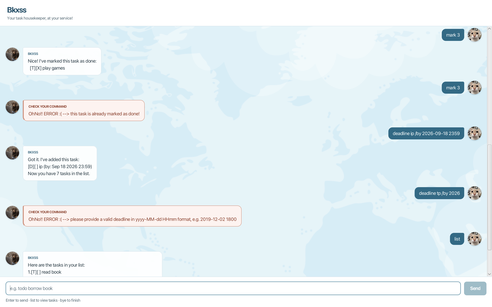

# Bkxss User Guide

**Bkxss** is a desktop task assistant for keeping track of todos, deadlines,
and events. It can also search your tasks and find the earliest free time in
your schedule.



## Quick start

1. Ensure that Java 25 is installed.
2. Put `bkxss.jar` in a folder where Bkxss can create its `data` folder.
3. Open a terminal in that folder and run:

   ```sh
   java -jar bkxss.jar
   ```

4. Type a command in the box at the bottom of the window, then press **Enter**
   or select **Send**.
5. Enter `bye` when you are finished, then close the window.

Bkxss saves every successful change automatically and reloads your tasks the
next time it starts.

> [!TIP]
> Start with `todo borrow book`, then enter `list` to see the task you added.

## Command summary

| Action | Command format |
| --- | --- |
| Add a todo | `todo DESCRIPTION` |
| Add a deadline | `deadline DESCRIPTION /by DATE` |
| Add an event | `event DESCRIPTION /from START /to END` |
| List all tasks | `list` |
| Find tasks | `find KEYWORD` |
| Find free time | `findfree HOURS /from START /to END` |
| Mark a task as done | `mark NUMBER` |
| Mark a task as not done | `unmark NUMBER` |
| Delete a task | `delete NUMBER` |
| Finish the session | `bye` |

Command words such as `todo` and `list` must be lowercase. Words in uppercase
in the formats above are values that you supply; do not type the uppercase
words literally.

Dates use the 24-hour format `yyyy-MM-dd HHmm`. For example, `2026-09-18 2359`
means 11:59 PM on 18 September 2026.

## Understanding the task list

Each task begins with a type and a completion status:

- `[T]` is a todo, `[D]` is a deadline, and `[E]` is an event.
- `[ ]` means not done and `[X]` means done.

For example, `[D][X] submit report (by: Sep 18 2026 23:59)` is a completed
deadline.

Run `list` whenever you need the current task numbers. These numbers may change
after a deletion.

## Features

### Adding a todo: `todo`

Adds a task without a date or time.

```text
todo borrow book
```

Format: `todo DESCRIPTION`

### Adding a deadline: `deadline`

Adds a task that must be completed by a specific date and time.

```text
deadline submit report /by 2026-09-18 2359
```

Format: `deadline DESCRIPTION /by DATE`

### Adding an event: `event`

Adds an activity that occupies a period in your schedule. The start must be
earlier than the end, but the event may cross midnight.

```text
event project meeting /from 2026-09-18 1400 /to 2026-09-18 1600
```

Format: `event DESCRIPTION /from START /to END`

### Listing tasks: `list`

Displays every saved task and its current number.

```text
list
```

### Finding tasks: `find`

Finds tasks whose descriptions contain the keyword. The search ignores letter
case but searches descriptions only, not dates or task types.

```text
find report
```

Format: `find KEYWORD`

Search results are numbered independently of the full task list. Run `list`
before using `mark`, `unmark`, or `delete` so that you use the task's current
list number.

### Finding free time: `findfree`

Finds the earliest continuous free slot within a search period.

```text
findfree 2 /from 2026-09-18 0900 /to 2026-09-18 1800
```

Format: `findfree HOURS /from START /to END`

`HOURS` must be a positive whole number. Bkxss treats all events as occupied
time, including completed events, but todos and deadlines do not occupy time.
The search may cross midnight and does not assume working or sleeping hours,
so choose the exact range you want searched.

### Marking a task as done: `mark`

```text
mark 2
```

Format: `mark NUMBER`

`NUMBER` is the task number shown by `list`.

### Marking a task as not done: `unmark`

```text
unmark 2
```

Format: `unmark NUMBER`

### Deleting a task: `delete`

Permanently removes a task. The remaining tasks are renumbered.

```text
delete 2
```

Format: `delete NUMBER`

### Finishing the session: `bye`

```text
bye
```

Bkxss shows a farewell and disables further input. Close the window to exit.

## Input and saved data

- Extra spaces and tabs are normalized automatically.
- Descriptions may contain Unicode text and punctuation, but cannot contain
  `|`, line breaks, or control characters.
- Named parameters such as `/by`, `/from`, and `/to` must appear exactly once
  and in the order shown in the command format.
- An invalid command does not change your task list.
- An exact duplicate cannot be added. Completion status does not make an
  otherwise identical task different.
- Tasks are stored in `data/bkxss.txt` relative to the folder from which Bkxss
  is run. Avoid editing this file while Bkxss is open.

If Bkxss reports damaged saved data, back up and repair `data/bkxss.txt`, then
restart the application. Read-only commands such as `list` remain available,
but Bkxss blocks changes to protect the original file. If saving fails, check
the folder permissions and available disk space before retrying.
